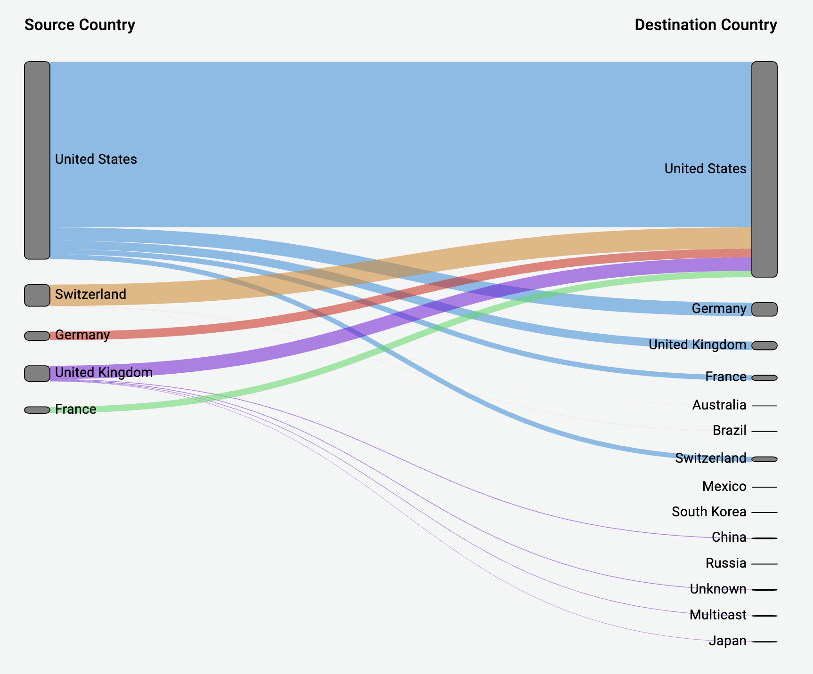

# Grafana Plugins - Sankey Panel 

<h2 id="use">用途</h2>

適合可視化水流數據，並且水流的寬度將與所選指標成比例

<h2 id="install">安裝方式</h2>

搜尋 Grafana Plugins 中的 Sankey Panel 並點擊 INSTALL 或於終端機中輸入以下指令

```linux
grafana-cli plugins install netsage-sankey-panel
```
<h2 id="example">範例</h2>



<h2 id="do_example">實作練習</h2>


